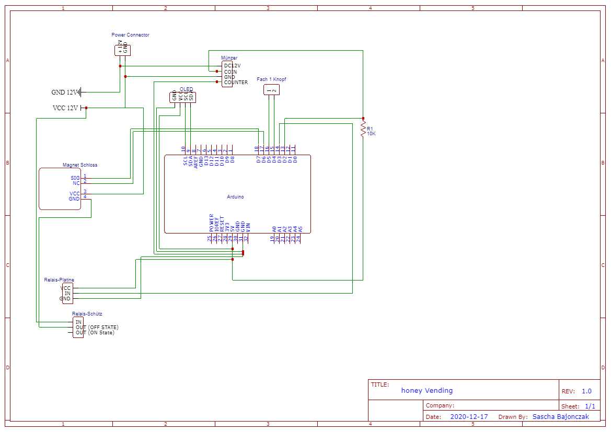

# Allgemeines
Dies soll mein kleines Honigautomaten Projekt vorstellen. 
Grundlegend habe ich den Fokus darauf gelegt den Quelltext so einfach wie nur möglich zu gestalten.

Erstellt und Kompliiert habe ich das Projekt mit [Plattform IO in VS Code](https://platformio.org/install/ide?install=vscode). Vorteil war für ich das hier eine Autovervollständigung vorhanden ist (Intellisense).

# Teileliste
Folgende Geräte habe ich im Einsatz

## OLED 
[ 0,96 Zoll OLED Display I2C 128 x 64 Pixel](https://www.amazon.de/AZDelivery-Display-Arduino-Raspberry-gratis/dp/B01L9GC470/ref=pd_nav_hcs_rp_2?pd_rd_w=58E2g&pf_rd_p=beed161f-44e1-4e49-9307-12d032ddf97d&pf_rd_r=DNT987TSETN6W7Z4G179&pd_rd_r=ef147d6b-b653-4bab-b445-080992e55942&pd_rd_wg=LUVkn&pd_rd_i=B01L9GC470&psc=1)

## Ardunio UNO 
Dies ist das Herzstück, hier kann aber auch ein reiner ESP 8266 verwendet werden. 
Aktuell habe ich den UNO genommen, weil ich den noch frei hatte. 

## Relais Platine 

Die [Relaisplatine](https://www.ebay.de/itm/1-16-Kanal-Relais-Optokoppler-Modul-f%C3%BCr-Arduino-Raspberry-Relaiskarte-5-12-230V/353149007504?ssPageName=STRK%3AMEBIDX%3AIT&var=622346727351&_trksid=p2060353.m2749.l2649) wird für die schaltung zum Türöffner verwendet 

## Münzer 
Damit ich die Münzen prüfen kann, habe ich einen [Münzer](https://www.ebay.de/itm/Multi-M%C3%BCnzpr%C3%BCfer-Auswahl-f%C3%BCr-Automaten-akzeptieren-6-Arten-von-M%C3%BCnzen-Euro-Coins/124268975741?ssPageName=STRK%3AMEBIDX%3AIT&_trksid=p2060353.m2749.l2649) von Ebay gekauft. Dieser ist gut und kann sehr einfach angelernt werden.

## Knöpfe
Ja Knöpfe kann man überall verwenden :) Hier ist es so, dass ich damit die Auswahl der Fächer steuere und somit bei einem Kauf die entsprechende Tür der Box öffne.
Dabei ist es egal, welche verwendet werden. 

Aktuell habe ich [diese](https://www.amazon.de/gp/product/B07ZYJ6R6M/ref=ppx_yo_dt_b_asin_title_o04_s00?ie=UTF8&psc=1) verwendet.

## Türschloss
Ich habe ein [Türschloß](https://www.ebay.de/itm/Elektro-Magnetschloss-Elektrische-Verriegelung-Schrank-Schlossfalle-T%C3%BCr%C3%B6ffner/333597120726?ssPageName=STRK%3AMEBIDX%3AIT&_trksid=p2060353.m2749.l2649) verwendet, welches einmal einen öffner besitzt. Auch zeitgliech einen Signalgeber für den Schließ Mechanismuss. 

# Verkabelung
Das Ganze ist wie folgt zusammengesetzt. Aktuell ist es noch notwendig, dass zwei Separate Stomkreise verwendet werden. 12V und 5V. 

# Offene Todos

* Einen Stromkreis verwenden indem ein Spannungsteiler verwendet wird
* Unterstützung mehrere Fächer
* Verwendung eines ESP 8266 Moduls anstatt eines Arduninos
* WLAN Übermittlung der Verkäufe

